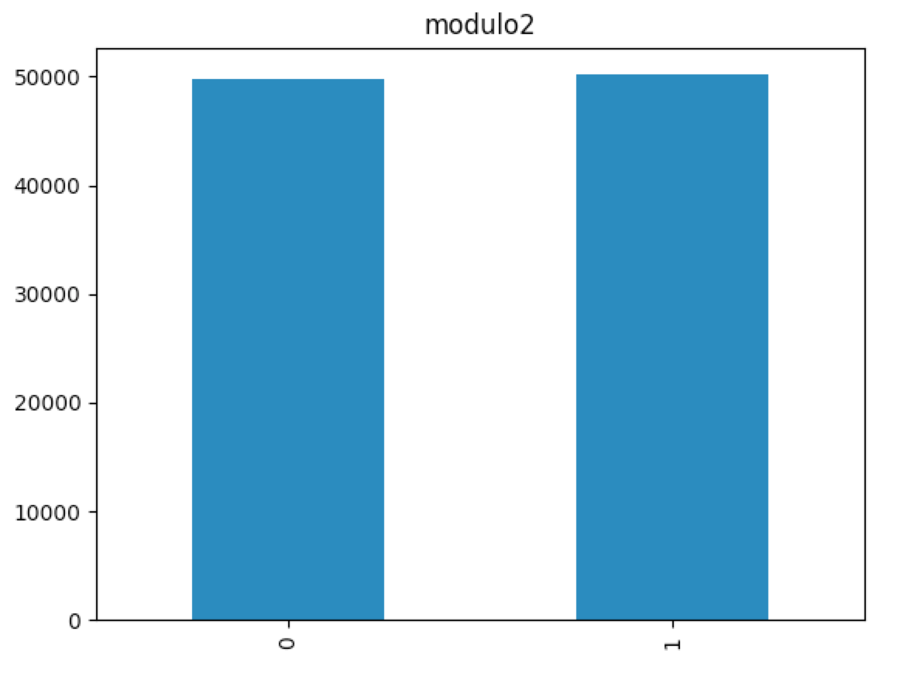

# Casino Ethereum

This is a smart contract about a casino game contract based on ethereum

## About the game

### How to generate a random number?

Actually, generate a random number on ethereum is not a easy thing, but
after many appempts and explorations by different developers, we could do this.

Maybe there are some other ways to generate random number, for simplicity, i will
just show the code how we generate a random number.

```
const reveal = web3.utils.randomHex(32)
const commit = web3.utils.soliditySha3(reveal)
```

Then push the `commit` to ethereum by a transaction, and get a blockHash or that block.

```
const randomNumber = web3.utils.soliditySha3(reveal, blockHash)
```
The `randomNumber` is the final random number.

The way to generate random number was inspired by [Dice2Win](https://github.com/dice2-win/contracts/blob/master/Dice2Win.sol)

### The random number is random enough?

To be honestly, i can not tell that right now(maybe some days later).

But i could supply some statistic data(100 000 rows data), and specific frequency count.

| blockNumber | blockHash | reveal | randomNumber | modulo2 | modulo6 | modulo36 | modulo 100 |


You can get the source data in `block_reveal_modulo_result.csv`, there are some statistic image about each modulo.




## Dependencies

1. nodejs, and make sure it's version above 8.0.0
2. npm
3. truffle
4. ganache

## Build
1. First run `npm install` to install node_modules
2. Then run `truffle compile`

## Run tests
1. run `truffle test` to execute tests

## Deploy
1. Before deploy you need to add your owner mnemonic to `truffle.js` like this:
```
const HDWalletProvider = require("truffle-hdwallet-provider")
const mnemonic = '<----12 words---->'

module.exports = {
  networks: {
    development: {
      host: "localhost",
      port: 7545,
      network_id: "*"
    },
    ropsten: {
      provider: function() {
        return new HDWalletProvider(mnemonic, "https://ropsten.infura.io/<----YOUR_API_KEY---->")
      },
      network_id: 3,
      gas: 4000000
    }
  },
  solc: {
    optimizer: {
      enabled: true,
      runs: 200
    }
  }
}
```
2. run `truffle deploy --network testnet` to deploy contract to ropsten network
3. run `truffle deploy --network mainnet` to deploy contract to mainnet network
